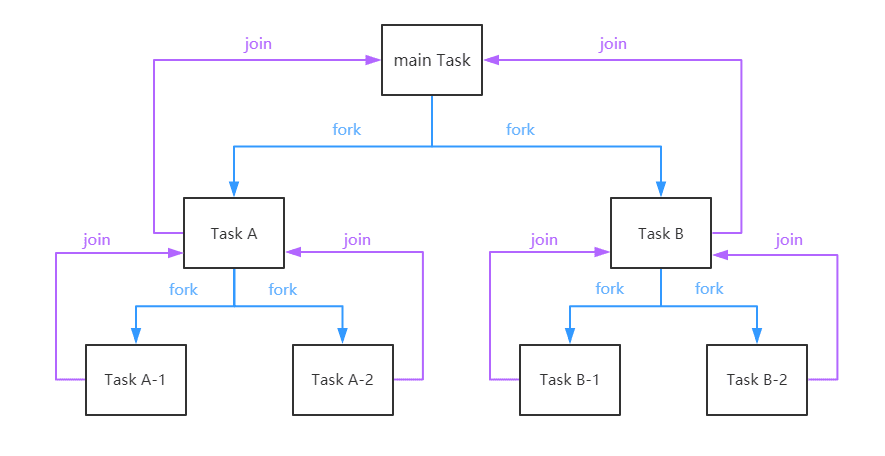

## ForkJoinPool 实现多核并行计算
### 说明
通常在计算机中，每个任务都是交由每个线程来处理的，当一个非常耗时的任务交由一个线程来完成，而其他线程处于空闲状态时就显得不太合理。

ForkJoinPool 又叫分而治之，通俗来讲就是帮我们把一个任务分成许多小任务给不同的线程执行，然后通过 join 将多个线程处理的结果进行汇总返回。

### 模型
ForkJoinPool线程池中的每个线程都有自己的工作队列（这一点和ThreadPoolExecutor不同，ThreadPoolExecutor是所有线程共用一个工作队列）。

ForkJoinPool是ExecutorService的实现类，因此是一种特殊的线程池。

### ForkJoinPool内部中将Task分为两种
* SubmissionTask：本地线程调用submit方法提交了任务
* WorkerTask：框架内部fork出来的子任务

> 这两种任务都是保存在WorkQueue数组中的，内部通过哈希算法将任务与线程关联起来。他们的存放与WorkQueue位置有些特点，SubmissionTask存放于数组中的偶数索引位置，WorkerTask存放于奇数索引位置。

### 提交任务的两种方式
在提交任务时，一般不会直接继承ForkJoinTask，只要继承它的子类即可：
* RecursiveAction:用于没有返回结果的任务(类似Runnable)
* RecursiveTask:用于有返回结果的任务(类似Callable)

### 构造函数
* parallelism：由几个线程来拆分任务，如果不填则更具CPU核数创建线程数
* factory：创建工作线程的工厂实现
* handler：线程因未知异常而终止的回调处理
* asyncMode：是否异步，默认false

```java
ForkJoinPool()
ForkJoinPool(int parallelism)
ForkJoinPool(int parallelism, ForkJoinWorkerThreadFactory factory, UncaughtExceptionHandler handler, boolean asyncMode)
```

### ForkJoinPool的运行图


### 参考
* [使用Folk/Join框架实现多核并行计算学习笔记](https://www.vincentli.top/2019/08/12/fork-join-pool-study-note/)